# 🌀 Sistema de Criptografia por FFT (256x256)

Este projeto é um sistema de criptografia visual avançado que opera no **domínio das frequências**, utilizando a **Transformada Rápida de Fourier (FFT) em duas dimensões**. Desenvolvido inteiramente em Python e sem o uso de bibliotecas matemáticas externas (como `numpy` ou o módulo nativo `math`), o sistema implementa todos os cálculos trigonométricos e transformadas de forma puramente manual.

---

## 🚀 Como Funciona a Criptografia por FFT?

Ao contrário dos métodos tradicionais de criptografia de imagem que operam diretamente nos pixels (domínio espacial), este sistema decompõe a imagem em suas frequências senoidais e cossenaidais constituintes. O processo de embaralhamento ocorre em uma dimensão matemática abstrata, tornando os padrões visuais completamente indetectáveis.

### Diagrama de Fluxo (Workflow)

```mermaid
graph TD
    %% Fluxo de Criptografia
    subgraph Criptografia [Fluxo de Criptografia]
        A[Imagem Original 256x256] -->|Leitura RGB| B[Matrizes de Canais R, G, B]
        B -->|2D FFT Cooley-Tukey| C[Matrizes de Frequências Complexas]
        D[Senha do Usuário] -->|Seed Determinística| E[Matriz de Ruído Caótico 2D]
        C -->|Soma de Matrizes| F[Espectro Corrompido]
        E --> F
        F -->|Salvamento de Alta Precisão| G[Arquivo Criptografado .txt]
    end

    %% Fluxo de Descriptografia
    subgraph Descriptografia [Fluxo de Descriptografia]
        H[Arquivo Criptografado .txt] -->|Leitura Decimal| I[Espectro Corrompido Recriado]
        J[Senha Correta] -->|Mesma Seed Determinística| K[Mesma Matriz de Ruído Caótico]
        I -->|Subtração de Matrizes| L[Frequências Restauradas]
        K --> L
        L -->|2D IFFT Cooley-Tukey| M[Canais R, G, B Espaciais]
        M -->|Reconstrução e Clipping| N[Imagem Decodificada .png]
    end

    style Criptografia fill:#1a1c23,stroke:#7928ca,stroke-width:2px,color:#fff
    style Descriptografia fill:#1a1c23,stroke:#0070f3,stroke-width:2px,color:#fff
```



---

## 🛠️ Arquitetura do Projeto

O código está estruturado de forma modular e altamente documentada em arquivos dedicados no diretório `fourier_cipher/`:

```
Fourier/
├── fourier_cipher/
│   ├── fft_module.py       # Algoritmos manuais de Trigonometria e FFT 1D/2D
│   ├── image_module.py     # Carregamento de imagens, exportação e salvamento de TXT
│   ├── matrix_module.py    # Validação de senhas, geração de ruído e cifragem
│   └── main.py             # Interface de linha de comando (CLI) e fluxo principal
├── .gitignore              # Ignora arquivos temporários e de cache
└── README.md               # Este arquivo de documentação
```

### Detalhes dos Módulos

1. **`fft_module.py` (O Coração Matemático)**
   * **Série de Taylor:** Implementação manual de `seno` e `cosseno` com 15 termos de Taylor, garantindo precisão de ponto flutuante idêntica à do processador.
   * **Fórmula de Euler:** Exponencial complexa $e^{i\theta} = \cos(\theta) + i\sin(\theta)$ para cálculo dos *twiddle factors* (fatores de rotação).
   * **FFT 1D & 2D (Cooley-Tukey):** Abordagem clássica de dividir e conquistar de complexidade $O(N \log N)$ para processamento bidimensional das imagens.
   
2. **`matrix_module.py` (A Camada de Segurança)**
   * **Cifragem Determinística por Semente:** A senha inserida atua como uma *Seed* para a biblioteca `random`. Isso garante que a exata mesma senha gere a exata mesma matriz de ruído aleatório (entre -1.000.000 e 1.000.000) para cada pixel 256x256.
   * **Segurança Tridimensional:** O ruído determinístico é injetado simultaneamente na parte **Real** e na parte **Imaginária** das frequências da imagem.

3. **`image_module.py` (Manipulação e Entrada/Saída)**
   * **Restrição de Resolução:** Aceita estritamente imagens de resolução **256x256** pixels para garantir a otimização dos cálculos de potências de 2 da FFT.
   * **Matriz Complexa de Alta Precisão (.txt):** Salva as matrizes complexas com formatação decimal de até 6 casas após a vírgula. Isso previne qualquer perda de precisão que ocorreria se fossem salvas em formatos de imagem comuns de 8 bits.

4. **`main.py` (O Maestro)**
   * Interface interativa via terminal (CLI) com menu de opções e tratamento robusto de exceções (`try/except`) para evitar quedas abruptas de execução.

---

## 🔒 Regras de Senha do Sistema

Para garantir a integridade dos algoritmos de criptografia e evitar "lixo matemático", a senha digitada deve obedecer estritamente às seguintes regras:
* **Numérica:** Deve conter apenas dígitos de `0` a `9`.
* **Comprimento Par:** A quantidade total de dígitos deve ser um número par.
* **Tamanho Máximo:** No máximo **8 dígitos** de comprimento.
* **Preenchimento:** Não pode ser vazia.

> [!CAUTION]
> **Atenção:** Devido à natureza caótica da criptografia com base em sementes, errar um único dígito da senha no processo de descriptografia resultará em uma imagem completamente corrompida e irrecuperável. Não há como redefinir ou recuperar imagens sem a senha exata.

---

## 💻 Como Rodar o Projeto

### Pré-requisitos
Apenas o interpretador Python 3 e a biblioteca **Pillow** (usada para ler e converter os pixels da imagem no início do fluxo).

```bash
pip install Pillow
```

### Executando o Programa
1. Entre na pasta raiz do projeto no seu terminal.
2. Execute o arquivo principal:
```bash
python fourier_cipher/main.py
```

### Operação de Exemplo
1. **Criptografar uma Imagem:**
   * Certifique-se de que sua imagem original tem exatamente **256x256** pixels e está na pasta do projeto (ex: `original.png`).
   * Escolha a Opção `1` no menu.
   * Insira o caminho da imagem (ex: `original.png`).
   * Digite uma senha válida (ex: `1234`).
   * Escolha o nome do arquivo criptografado de saída (ex: `cripto.txt`). O arquivo será salvo na mesma pasta do script!

2. **Descriptografar uma Imagem:**
   * Escolha a Opção `2` no menu.
   * Insira o caminho do arquivo criptografado (ex: `cripto.txt`).
   * Digite a senha numérica exata usada na criptografia.
   * Escolha o nome da imagem restaurada (ex: `decripto.png`).

---

## 🔬 Curiosidades Tecnológicas

> [!NOTE]
> **Por que salvar em `.txt` em vez de uma imagem borrada?**
> A FFT lida com números complexos muito grandes e partes decimais cruciais. Ao tentar salvar uma imagem de frequências em PNG ou JPG convencional, os valores de ponto flutuante precisariam ser comprimidos e convertidos em inteiros de 0 a 255. Essa compressão remove detalhes matemáticos insubstituíveis, tornando a transformada inversa (IFFT) matematicamente incapaz de reconstruir a imagem original sem gerar um borrão sem nexo. O salvamento em `.txt` preserva as partes reais e imaginárias com precisão de dupla precisão de 6 casas decimais!
