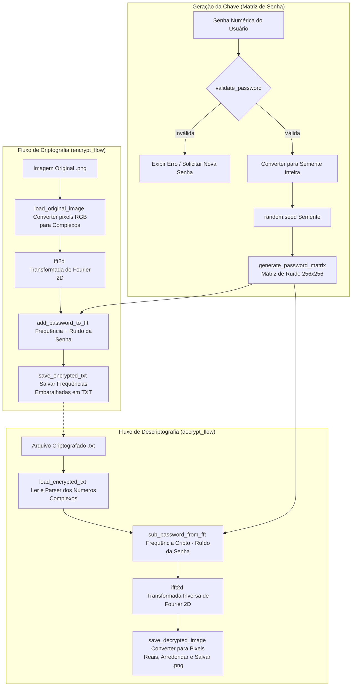

# Documentação do Sistema de Criptografia por FFT (Fast Fourier Transform)

Este documento detalha o funcionamento de cada módulo e função do sistema de criptografia e descriptografia de imagens no domínio da frequência, utilizando a Transformada Rápida de Fourier (FFT).

---

## 1. Fluxograma de Funcionamento do Sistema

O diagrama abaixo ilustra o fluxo de processamento de ponta a ponta para os processos de **Criptografia** e **Descriptografia**, evidenciando o papel da **Senha** na geração da matriz de ruído determinística.

---

## 2. Detalhamento dos Módulos e Funções

O sistema está dividido em quatro módulos principais:
1. `fft_module.py` – Implementação matemática da FFT/IFFT 1D e 2D de forma manual.
2. `image_module.py` – Leitura de imagem, conversão de dados e manipulação de arquivos TXT/PNG.
3. `matrix_module.py` – Geração de matriz caótica baseada na semente (senha) e operações de mascaramento.
4. `main.py` – Orquestrador do menu interativo e fluxo principal.

---

### Módulo: `fft_module.py`
Este módulo contém a biblioteca matemática personalizada do sistema, construída sem depender de bibliotecas externas (como `math` ou `numpy`).

#### `meu_sin(x)`
* **Objetivo**: Calcula o seno de um ângulo $x$ em radianos através da Série de Taylor.
* **Funcionamento**: 
  1. Reduz o ângulo $x$ ao intervalo $[-\pi, \pi]$ para acelerar a convergência.
  2. Soma os 15 primeiros termos da Série de Taylor do seno:
     $$\sin(x) = \sum_{n=0}^{\infty} \frac{(-1)^n x^{2n+1}}{(2n+1)!}$$
  3. Garante precisão adequada para cálculo computacional do tipo `float`.

#### `meu_cos(x)`
* **Objetivo**: Calcula o cosseno de um ângulo $x$ em radianos.
* **Funcionamento**: Usa a relação trigonométrica de translação:
  $$\cos(x) = \sin\left(x + \frac{\pi}{2}\right)$$

#### `meu_exp_complex(angulo)`
* **Objetivo**: Calcula a exponencial complexa $e^{i \theta}$ (fator de rotação ou *twiddle factor*).
* **Funcionamento**: Aplica a Fórmula de Euler:
  $$e^{i \theta} = \cos(\theta) + i\sin(\theta)$$
  Retorna um número complexo nativo do Python (`complex(real, imag)`).

#### `fft1d(x)`
* **Objetivo**: Calcula a Transformada Rápida de Fourier (FFT) em uma lista 1D.
* **Funcionamento**: Implementa o algoritmo recursivo de Cooley-Tukey (Dividir e Conquistar):
  1. Condição de parada: se a lista tem tamanho $\le 1$, retorna a lista.
  2. Divide a entrada em listas de índices pares e ímpares.
  3. Aplica a FFT recursivamente em ambas as metades.
  4. Combina os resultados multiplicando a parte ímpar pelo fator de rotação complexo $W_N^k = e^{-i\frac{2\pi k}{N}}$.

#### `ifft1d(x)`
* **Objetivo**: Calcula a Transformada Inversa Rápida de Fourier (IFFT) em 1D.
* **Funcionamento**: Utiliza uma relação de conjugação matemática:
  1. Constrói o conjugado complexo de cada elemento do vetor.
  2. Executa a `fft1d` convencional nesse vetor conjugado.
  3. Aplica o conjugado ao resultado final e divide tudo pelo tamanho $N$ da amostra.

#### `fft2d(matriz)`
* **Objetivo**: Aplica a FFT em duas dimensões (matriz 2D).
* **Funcionamento**: 
  1. Aplica `fft1d` a cada linha da matriz.
  2. Transpõe a matriz (linhas viram colunas).
  3. Aplica `fft1d` a cada nova linha (colunas originais).
  4. Transpõe novamente para devolver o resultado na orientação original.

#### `ifft2d(matriz)`
* **Objetivo**: Aplica a IFFT em duas dimensões.
* **Funcionamento**: Segue o mesmo algoritmo da `fft2d`, mas chama `ifft1d` no lugar da transformada direta.

---

### Módulo: `image_module.py`
Este módulo cuida da tradução dos dados entre o formato físico (arquivos `.png` e `.txt`) e o formato matemático em memória RAM.

#### `load_original_image(caminho)`
* **Objetivo**: Carrega uma imagem de tamanho $256 \times 256$ do disco e separa seus pixels em canais de números complexos.
* **Funcionamento**:
  1. Abre a imagem em modo RGB utilizando a biblioteca PIL.
  2. Valida se as dimensões são exatamente $256 \times 256$ pixels.
  3. Separa os pixels nos canais Vermelho (Red), Verde (Green) e Azul (Blue).
  4. Inicializa os canais como números complexos cuja parte imaginária é nula: $R + 0j$, $G + 0j$ e $B + 0j$.

#### `save_encrypted_txt(canais_complexos, caminho)`
* **Objetivo**: Salva as frequências complexas criptografadas em arquivo de texto.
* **Funcionamento**:
  1. Grava sequencialmente no arquivo as matrizes R, G e B (totalizando 768 linhas).
  2. Cada número complexo é salvo textualmente na estrutura `"ParteReal,ParteImaginaria"` com 6 casas decimais de precisão (evitando perdas por arredondamento que invalidariam a descriptografia).
  3. Os valores em uma mesma linha são delimitados por espaço.

#### `load_encrypted_txt(caminho)`
* **Objetivo**: Reconstrói as matrizes de números complexos a partir do arquivo TXT.
* **Funcionamento**:
  1. Lê as 768 linhas do arquivo TXT.
  2. Realiza o parse de cada elemento texto separando parte real e imaginária por vírgula.
  3. Reconstrói as matrizes correspondentes a cada um dos canais R, G e B no formato `complex`.

#### `save_decrypted_image(canais_complexos, caminho)`
* **Objetivo**: Converte os canais de frequências espaciais restaurados em uma imagem física utilizável.
* **Funcionamento**:
  1. Percorre a matriz $256 \times 256$.
  2. Calcula o valor absoluto (magnitude) de cada componente complexa usando `abs()`. Isso elimina quaisquer ruídos residuais no canal imaginário criados por imprecisões decimais.
  3. Arredonda o valor para o inteiro mais próximo.
  4. Aplica *Clipping* para forçar a cor a permanecer na faixa válida do sistema de cores do computador:
     $$\text{pixel} = \max(0, \min(255, \text{valor}))$$
  5. Salva o arquivo resultante como PNG.

---

### Módulo: `matrix_module.py`
Módulo responsável pelas operações de validação de chaves e mascaramento de ruído no domínio da frequência.

#### `validate_password(senha)`
* **Objetivo**: Analisa a senha fornecida pelo usuário frente às regras do negócio.
* **Regras de Validação**:
  * Deve conter apenas caracteres numéricos.
  * O tamanho máximo da string deve ser de 8 dígitos.
  * O comprimento da string de senha deve ser um número par.
  * A senha não pode ser vazia.

#### `generate_password_matrix(senha_str, largura, altura)`
* **Objetivo**: Produz uma matriz $256 \times 256$ de números pseudo-aleatórios determinísticos.
* **Funcionamento**:
  1. Converte a string de senha em um número inteiro correspondente.
  2. Inicializa o gerador de números pseudo-aleatórios `random.seed(semente)`.
  3. Gera valores inteiros entre $-1.000.000$ e $1.000.000$ para cada posição $(y, x)$.
  4. A garantia do `seed` faz com que senhas iguais produzam exatamente a mesma matriz de ruído todas as vezes.

#### `add_password_to_fft(matriz_fft, matriz_senha)`
* **Objetivo**: Embaralha as frequências aplicando a máscara de ruído.
* **Funcionamento**: Para cada célula da FFT de coordenadas $(y, x)$, soma o valor caótico da matriz de senha em ambas as partes (real e imaginária):
  $$\text{NovoReal} = \text{FFTReal} + \text{Ruido}$$
  $$\text{NovoImag} = \text{FFTImag} + \text{Ruido}$$

#### `sub_password_from_fft(matriz_criptografada, matriz_senha)`
* **Objetivo**: Remove o ruído criptográfico das frequências.
* **Funcionamento**: Realiza a operação inversa da adição. Para cada coordenada $(y, x)$, subtrai o ruído determinístico gerado:
  $$\text{RealLimpo} = \text{CriptoReal} - \text{Ruido}$$
  $$\text{ImagLimpo} = \text{CriptoImag} - \text{Ruido}$$
  Se a senha fornecida for incorreta, a matriz gerada será diferente e a subtração adicionará ainda mais ruído caótico ao arquivo.

---

### Módulo: `main.py`
Este módulo orquestra os componentes e apresenta a interface para o usuário no console.

#### `print_menu()`
* **Objetivo**: Renderiza o menu ASCII inicial no console.

#### `get_password()`
* **Objetivo**: Trata a entrada da senha pelo console. Mantém o usuário em um loop de entrada até que passe com sucesso pela função `validate_password`.

#### `encrypt_flow()`
* **Objetivo**: Executa sequencialmente o fluxo de criptografia.
  1. Solicita a imagem de origem.
  2. Carrega a imagem RGB (`load_original_image`).
  3. Solicita a senha e gera a matriz caótica correspondente.
  4. Executa a `fft2d` em cada um dos três canais da imagem.
  5. Adiciona o ruído na frequência (`add_password_to_fft`).
  6. Grava a matriz cifrada em formato texto (`save_encrypted_txt`).

#### `decrypt_flow()`
* **Objetivo**: Executa sequencialmente o fluxo de descriptografia.
  1. Solicita o caminho do arquivo TXT contendo as frequências.
  2. Carrega as matrizes complexas cifradas (`load_encrypted_txt`).
  3. Solicita a senha e gera a matriz caótica correspondente.
  4. Subtrai o ruído das matrizes de frequência (`sub_password_from_fft`).
  5. Executa a transformada inversa `ifft2d` nos canais para retornar ao domínio espacial.
  6. Reconstrói a imagem colorida e salva como PNG (`save_decrypted_image`).

#### `main()`
* **Objetivo**: Ponto de entrada do executável. Apresenta o menu iterativo e faz o roteamento entre as opções digitadas pelo usuário (1 para criptografar, 2 para descriptografar, 3 para sair).
