# Fluxogramas de Criptografia — Fourier Cipher

---

## Fluxograma 1 — Criptografia de Imagem

```mermaid
flowchart TD
    START([Arquivo de Imagem - PNG / BMP / JPG])

    subgraph IO ["I/O — image_io.py"]
        IO1["Leitura com Pillow — Image.open()"]
        IO2{"Modo da Imagem?"}
        IO3["Separar 3 canais R, G, B em matrizes 2D"]
        IO4["Canal único de tons de cinza"]
        IO5["Converter para RGB — img.convert('RGB')"]
        IO1 --> IO2
        IO2 -->|RGB| IO3
        IO2 -->|Grayscale L| IO4
        IO2 -->|Outros| IO5
        IO5 --> IO3
    end

    subgraph PRE ["Pré-processamento — image_cipher.py"]
        PRE1["Processar cada canal individualmente"]
        PRE2["Centralizar e Atenuar — scale_factor = 0.45<br/>p' = (p − 128.0 × 0.45) ÷ 128.0<br/>Range original [0, 255] → [−0.447, +0.447]"]
        PRE3["Criar número complexo com Im = 0<br/>representação: [real, 0.0]"]
        PRE4["Zero-Padding 2D<br/>Dimensões expandidas para a próxima potência de 2<br/>_next_pow2(h) × _next_pow2(w)"]
        PRE1 --> PRE2 --> PRE3 --> PRE4
    end

    subgraph FFT2D ["FFT 2D — fft_engine.py"]
        FFT1["Aplicar FFT 1D em cada linha da matriz"]
        FFT2["Transpor a matriz — linhas viram colunas"]
        FFT3["Aplicar FFT 1D em cada coluna transposta"]
        FFT4["Transpor de volta<br/>Resultado: espectro complexo X[u, v]"]
        FFT1 --> FFT2 --> FFT3 --> FFT4
    end

    subgraph BF ["Borboleta Cooley-Tukey — por estágio — fft_engine.py"]
        BF1["Bit-Reversal Permutation — reordena o array in-place"]
        BF2["Pré-calcular Twiddle Factors — cacheados por tamanho N<br/>W_N^k = cos(−2πk/N) + j·sin(−2πk/N)"]
        BF3["Borboleta por estágio — log₂(N) estágios<br/>X[k]       = E[k] + W^k · O[k]<br/>X[k + N/2] = E[k] − W^k · O[k]"]
        BF1 --> BF2 --> BF3
    end

    subgraph KEY ["Geração da Chave — key_engine.py"]
        KEY1["Usar senha como semente — random.seed(password)"]
        KEY2["Gerar matriz 2D aleatória de pixels em [0, 255]<br/>Tamanho: pad_h × pad_w"]
        KEY3["Calcular FFT 2D da matriz da senha<br/>K[u, v] = FFT2D(seed_matrix)"]
        KEY1 --> KEY2 --> KEY3
    end

    subgraph ROT ["Rotação Complexa no Domínio da Frequência — image_cipher.py"]
        ROT1["Para cada coeficiente X[u, v] e K[u, v]"]
        ROT2["Calcular magnitude da chave<br/>mag = sqrt(K_re² + K_im²)"]
        ROT3["Normalizar para rotor unitário<br/>u_re = K_re ÷ mag<br/>u_im = K_im ÷ mag"]
        ROT4["Aplicar rotação de fase — multiplicação complexa<br/>Y_re = X_re · u_re − X_im · u_im<br/>Y_im = X_re · u_im + X_im · u_re<br/>Equivalente a: Y = X · e^(jθ)"]
        ROT1 --> ROT2 --> ROT3 --> ROT4
    end

    subgraph IFFT2D ["IFFT 2D — fft_engine.py"]
        IFFT1["Aplicar IFFT 1D em cada linha<br/>ifft(X) = conj(fft(conj(X))) ÷ N"]
        IFFT2["Transpor a matriz"]
        IFFT3["Aplicar IFFT 1D em cada coluna"]
        IFFT4["Transpor de volta<br/>Resultado: y[i, j] no domínio do tempo"]
        IFFT1 --> IFFT2 --> IFFT3 --> IFFT4
    end

    subgraph POST ["Pós-processamento — image_cipher.py"]
        POST1["Extrair parte Real de cada complexo — y[i][j][0]"]
        POST2["Reescalar para inteiro<br/>val = round(y_real × 128.0 + 128.0)"]
        POST3["Clamp estrito — max(0, min(255, val))"]
        POST1 --> POST2 --> POST3
    end

    subgraph SAVE ["Salvar — image_io.py"]
        SAVE1["Recombinar canais R, G, B — np.stack([R, G, B], axis=-1)"]
        SAVE2["Salvar com Pillow — Image.fromarray().save()"]
        SAVE1 --> SAVE2
    end

    END([Imagem Criptografada — PNG / BMP])

    START --> IO1
    IO3 --> PRE1
    IO4 --> PRE1
    PRE4 --> FFT1
    FFT1 -.->|"executa internamente"| BF1
    FFT4 --> KEY1
    KEY3 --> ROT1
    ROT4 --> IFFT1
    IFFT4 --> POST1
    POST3 --> SAVE1
    SAVE2 --> END
```

---

## Fluxograma 2 — Criptografia de Áudio

```mermaid
flowchart TD
    START([Arquivo WAV — PCM-16 Mono ou Estéreo])

    subgraph IO ["I/O — audio_io.py"]
        IO1["Leitura com soundfile — sf.read(filepath, dtype='int16')"]
        IO2{"Mono ou Estéreo?"}
        IO3["Canal único — lista 1D de inteiros PCM"]
        IO4["Separar canais — data.T → lista de canais L e R"]
        IO5["Extrair metadados — sample_rate e bit_depth via sf.info()"]
        IO1 --> IO2
        IO2 -->|"Mono (1D)"| IO3
        IO2 -->|"Estéreo (2D)"| IO4
        IO1 --> IO5
    end

    subgraph PRE ["Pré-processamento — audio_cipher.py"]
        PRE1["Processar cada canal individualmente"]
        PRE2["Atenuar amplitude — scale_factor = 0.40<br/>amostra' = amostra × 0.40<br/>Reduz o PAPR — Peak-to-Average Power Ratio"]
        PRE3["Converter PCM-16 para complexo normalizado<br/>re = amostra ÷ 32768.0   im = 0.0<br/>Range [−32768, +32767] → [−1.0, +1.0]"]
        PRE4["Zero-Padding 1D<br/>N → próxima potência de 2 — _next_pow2(N)"]
        PRE1 --> PRE2 --> PRE3 --> PRE4
    end

    subgraph FFT1D ["FFT 1D — fft_engine.py — Algoritmo Cooley-Tukey Radix-2 DIT"]
        FFT1["Bit-Reversal Permutation — reordena array in-place"]
        FFT2["Pré-calcular Twiddle Factors — cacheados por tamanho N<br/>W_N^k = e^(−j·2πk/N) = cos(−2πk/N) + j·sin(−2πk/N)"]
        FFT3["Borboletas — log₂(N) estágios<br/>X[k]       = E[k] + W^k · O[k]<br/>X[k + N/2] = E[k] − W^k · O[k]"]
        FFT4["Espectro complexo X[k] — k = 0 até N−1"]
        FFT1 --> FFT2 --> FFT3 --> FFT4
    end

    subgraph KEY ["Geração da Chave — key_engine.py"]
        KEY1["Usar senha como semente — random.seed(password)"]
        KEY2["Gerar sinal aleatório no domínio do tempo<br/>re em [−32768, +32767]   im = 0.0   tamanho N"]
        KEY3["Calcular FFT 1D do sinal da senha<br/>K[k] = FFT(seed_signal)<br/>Garante Simetria Hermitiana exata"]
        KEY1 --> KEY2 --> KEY3
    end

    subgraph ROT ["Rotação Complexa no Domínio da Frequência — audio_cipher.py"]
        ROT1["Preservar DC e Nyquist sem rotação<br/>Y[0] = X[0]   e   Y[N÷2] = X[N÷2]<br/>Evita ruído espectral nos extremos"]
        ROT2["Para k = 1 até N÷2 − 1"]
        ROT3["Calcular magnitude da chave<br/>mag = sqrt(K_re² + K_im²)"]
        ROT4["Normalizar para rotor unitário<br/>u_re = K_re ÷ mag<br/>u_im = K_im ÷ mag"]
        ROT5["Aplicar rotação de fase — multiplicação complexa<br/>Y_re = X_re · u_re − X_im · u_im<br/>Y_im = X_re · u_im + X_im · u_re<br/>Equivalente a: Y[k] = X[k] · e^(jθ_k)"]
        ROT6["Forçar Simetria Hermitiana na segunda metade<br/>Y[N − k] = conj(Y[k])<br/>Elimina vazamento de ruído imaginário"]
        ROT1 --> ROT2 --> ROT3 --> ROT4 --> ROT5 --> ROT6
    end

    subgraph IFFT1D ["IFFT 1D — fft_engine.py"]
        IFFT1["Conjugar entrada — [re, −im] para cada elemento"]
        IFFT2["Aplicar FFT direta no sinal conjugado"]
        IFFT3["Conjugar saída e normalizar por N<br/>ifft(X) = conj(fft(conj(X))) ÷ N<br/>Resultado: [re ÷ N,  −im ÷ N]"]
        IFFT1 --> IFFT2 --> IFFT3
    end

    subgraph POST ["Pós-processamento — audio_cipher.py"]
        POST1["Extrair parte Real — y[k][0]"]
        POST2["Converter para inteiro PCM-16<br/>v = round(y_real × 32768.0)"]
        POST3["Aritmética Modular 65536 — garante reversibilidade perfeita<br/>v = (v + 32768) mod 65536 − 32768"]
        POST1 --> POST2 --> POST3
    end

    subgraph SAVE ["Salvar — audio_io.py"]
        SAVE1["Recombinar canais — np.array(channels).T<br/>Formato intercalado: (amostras, canais)"]
        SAVE2["Salvar com soundfile — sf.write() com subtype PCM_16"]
        SAVE1 --> SAVE2
    end

    END([Áudio Criptografado — WAV])

    START --> IO1
    IO3 --> PRE1
    IO4 --> PRE1
    PRE4 --> FFT1
    FFT4 --> KEY1
    KEY3 --> ROT1
    ROT6 --> IFFT1
    IFFT3 --> POST1
    POST3 --> SAVE1
    SAVE2 --> END
```

---

## Tabela de Equações por Etapa

### Imagem

| Etapa | Operação | Equação |
|---|---|---|
| Pré-processamento | Centralizar e Atenuar | `p' = (p − 128) × 0.45 / 128` |
| FFT 2D | Decomposição bidimensional | `X[u,v] = Σₙ Σₘ x[n,m] · e^(−j2π(un/N + vm/M))` |
| Chave | Espectro da senha 2D | `K[u,v] = FFT2D(seed_matrix)` |
| Rotor unitário | Normalização da chave | `u = K / |K|` |
| Rotação de fase | Multiplicação complexa | `Y[u,v] = X[u,v] · e^(jθ)` |
| IFFT 2D | Reconstrução 2D | `y[n,m] = (1/NM) Σ Y[u,v] · e^(j2π(un/N + vm/M))` |
| Pós-processamento | Reescalar para pixel | `val = round(y_real × 128 + 128)` |

### Áudio

| Etapa | Operação | Equação |
|---|---|---|
| Pré-processamento | Atenuar e Normalizar | `s' = (s × 0.40) / 32768` |
| FFT 1D | Decomposição espectral | `X[k] = Σₙ x[n] · e^(−j2πkn/N)` |
| Borboleta | Cooley-Tukey Radix-2 | `X[k] = E[k] + W^k · O[k]` e `X[k+N/2] = E[k] − W^k · O[k]` |
| Chave | Espectro da senha 1D | `K[k] = FFT(seed_signal)` |
| Rotor unitário | Normalização da chave | `u = K[k] / |K[k]|` |
| Rotação de fase | Multiplicação complexa | `Y[k] = X[k] · e^(jθ_k)` |
| Simetria Hermitiana | Conjugação da segunda metade | `Y[N−k] = conj(Y[k])` |
| IFFT 1D | Reconstrução temporal | `y[n] = conj(FFT(conj(X)))[n] / N` |
| Pós-processamento | Converter e modular | `v = (round(y_real × 32768) + 32768) mod 65536 − 32768` |
